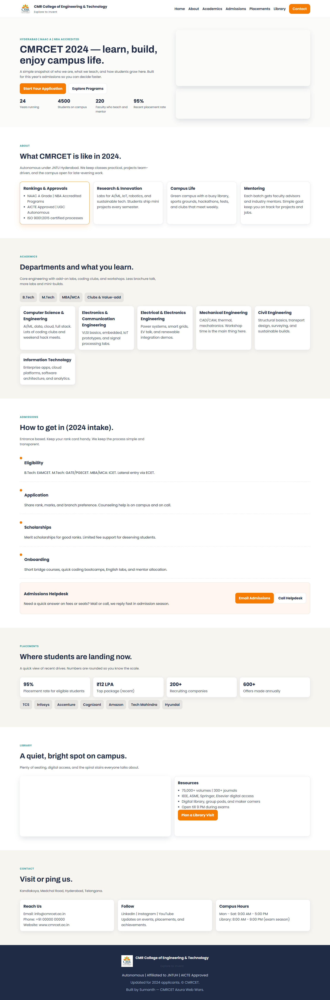

# CMRCET Website Redesign 🎓

## 🖼️ Project Preview

*(A snapshot of the redesign concept submitted for the competition)*

> **Competition Entry:** A modern, responsive redesign concept for the CMR College of Engineering & Technology official website. Built for the "Azura 2k24" frontend symposium.

## 🎯 The Challenge
The goal was to reimagine the college's legacy portal to improve accessibility and mobile responsiveness.

## 💻 Key Features
* **Modern Hero Section:** Clean navigation with the official college palette.
* **Dynamic Menus:** JavaScript-powered mobile toggle menu.
* **Department Showcase:** Grid layout for engineering branches.
* **Notice Board:** A dedicated section for college updates.

## 🚀 How to View
[**🔗 View Live Site**](https://sumanthkatta-dev.github.io/cmrcet-webwars-2024/)

> **⚠️ Seeing a Red "Dangerous Site" Warning?**
>
> Because this project uses the real college name (CMRCET) for the competition, Google's automated security bots may flag it as "Impersonation/Phishing." **This is a false positive.**
>
> **How to bypass the warning:**
> 1. Click the **"Details"** button on the red screen.
> 2. Click **"Visit this unsafe site"** (text is often underlined).
>
> *This is a 100% static student portfolio project and is completely safe to view.*

---
*Submitted by Sumanth Katta | April 2024*
